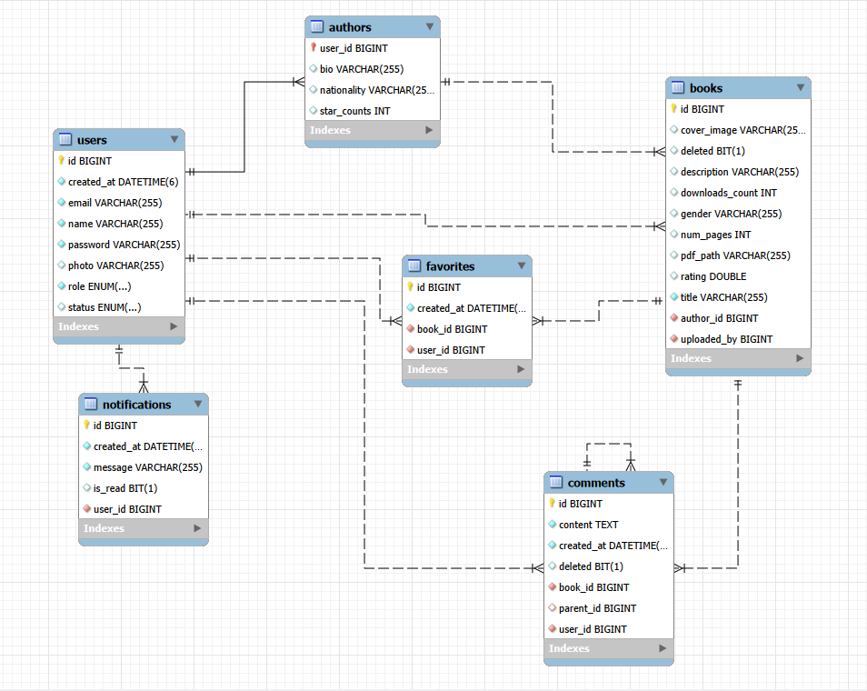

# Documentación técnica libreria web backend

### Casos de uso
USER:
- ver seccion de libros
- ver mas informacion de x libro
- guardar x libro en favoritos
- descargar contenido de x libro pdf
- ver comentarios de x libro
- comentar x libro
- ver libros favoritos
- gestion de perfil
- ver notificaciones de cuando un autor publique nuevo libro dentro de la app
AUTHOR (lo mismo que USER):
- registrar libro propio
- ver libros propios publicados
- editar informacion de libro
- eliminar libro
- ver estadisticas de sus libros: numeros de descargas, comentarios, cuantos favoritos (estrellas) tiene.
- responder comentarios de usuarios
ADMIN (lo mismo que USER y AUTHOR):
- eliminar comentarios
- ver historial de libros eliminados
- ver historial de comentarios eliminados
- gestion de usuarios/autores: activar, desactivar o cambiar roles
- panel de metricas: estadísticas globales (cantidad de libros, usuarios activos, descargas).

### DER en der.drawio

### Contrato de Endpoints (json)
servers - http://localhost:8080 

{"openapi":"3.1.0","info":{"title":"OpenAPI definition","version":"v0"},"servers":[{"url":"http://localhost:8080","description":"Generated server url"}],"paths":{"/api/users/{id}":{"get":{"tags":["user-controller"],"operationId":"getUserById","parameters":[{"name":"id","in":"path","required":true,"schema":{"type":"integer","format":"int64"}}],"responses":{"200":{"description":"OK","content":{"*/*":{"schema":{"$ref":"#/components/schemas/UserResponseDTO"}}}}}},"put":{"tags":["user-controller"],"operationId":"updateUser","parameters":[{"name":"id","in":"path","required":true,"schema":{"type":"integer","format":"int64"}}],"requestBody":{"content":{"application/json":{"schema":{"$ref":"#/components/schemas/UserRequestDTO"}}},"required":true},"responses":{"200":{"description":"OK","content":{"*/*":{"schema":{"$ref":"#/components/schemas/UserResponseDTO"}}}}}},"delete":{"tags":["user-controller"],"operationId":"deleteUser","parameters":[{"name":"id","in":"path","required":true,"schema":{"type":"integer","format":"int64"}}],"responses":{"200":{"description":"OK"}}}},"/api/books/{id}":{"get":{"tags":["book-controller"],"operationId":"getBookById","parameters":[{"name":"id","in":"path","required":true,"schema":{"type":"integer","format":"int64"}}],"responses":{"200":{"description":"OK","content":{"*/*":{"schema":{"$ref":"#/components/schemas/BookResponseDTO"}}}}}},"put":{"tags":["book-controller"],"operationId":"updateBook","parameters":[{"name":"id","in":"path","required":true,"schema":{"type":"integer","format":"int64"}}],"requestBody":{"content":{"application/json":{"schema":{"$ref":"#/components/schemas/BookRequestDTO"}}},"required":true},"responses":{"200":{"description":"OK","content":{"*/*":{"schema":{"$ref":"#/components/schemas/BookResponseDTO"}}}}}},"delete":{"tags":["book-controller"],"operationId":"deleteBook","parameters":[{"name":"id","in":"path","required":true,"schema":{"type":"integer","format":"int64"}}],"responses":{"200":{"description":"OK"}}}},"/api/authors/{userId}":{"get":{"tags":["author-controller"],"operationId":"getAuthorById","parameters":[{"name":"userId","in":"path","required":true,"schema":{"type":"integer","format":"int64"}}],"responses":{"200":{"description":"OK","content":{"*/*":{"schema":{"$ref":"#/components/schemas/AuthorResponseDTO"}}}}}},"put":{"tags":["author-controller"],"operationId":"updateAuthor","parameters":[{"name":"userId","in":"path","required":true,"schema":{"type":"integer","format":"int64"}}],"requestBody":{"content":{"application/json":{"schema":{"$ref":"#/components/schemas/AuthorRequestDTO"}}},"required":true},"responses":{"200":{"description":"OK","content":{"*/*":{"schema":{"$ref":"#/components/schemas/AuthorResponseDTO"}}}}}},"delete":{"tags":["author-controller"],"operationId":"deleteAuthor","parameters":[{"name":"userId","in":"path","required":true,"schema":{"type":"integer","format":"int64"}}],"responses":{"200":{"description":"OK"}}}},"/api/users":{"get":{"tags":["user-controller"],"operationId":"getAllUsers","responses":{"200":{"description":"OK","content":{"*/*":{"schema":{"type":"array","items":{"$ref":"#/components/schemas/UserResponseDTO"}}}}}}},"post":{"tags":["user-controller"],"operationId":"createUser","requestBody":{"content":{"application/json":{"schema":{"$ref":"#/components/schemas/UserRequestDTO"}}},"required":true},"responses":{"200":{"description":"OK","content":{"*/*":{"schema":{"$ref":"#/components/schemas/UserResponseDTO"}}}}}}},"/api/notifications/user/{userId}":{"get":{"tags":["notification-controller"],"operationId":"getUserNotifications","parameters":[{"name":"userId","in":"path","required":true,"schema":{"type":"integer","format":"int64"}}],"responses":{"200":{"description":"OK","content":{"*/*":{"schema":{"type":"array","items":{"$ref":"#/components/schemas/NotificationResponseDTO"}}}}}}},"post":{"tags":["notification-controller"],"operationId":"createNotification","parameters":[{"name":"userId","in":"path","required":true,"schema":{"type":"integer","format":"int64"}},{"name":"message","in":"query","required":true,"schema":{"type":"string"}}],"responses":{"200":{"description":"OK","content":{"*/*":{"schema":{"$ref":"#/components/schemas/NotificationResponseDTO"}}}}}}},"/api/favorites/user/{userId}/book/{bookId}":{"get":{"tags":["favorite-controller"],"operationId":"isFavorite","parameters":[{"name":"userId","in":"path","required":true,"schema":{"type":"integer","format":"int64"}},{"name":"bookId","in":"path","required":true,"schema":{"type":"integer","format":"int64"}}],"responses":{"200":{"description":"OK","content":{"*/*":{"schema":{"type":"boolean"}}}}}},"post":{"tags":["favorite-controller"],"operationId":"addFavorite","parameters":[{"name":"userId","in":"path","required":true,"schema":{"type":"integer","format":"int64"}},{"name":"bookId","in":"path","required":true,"schema":{"type":"integer","format":"int64"}}],"responses":{"200":{"description":"OK","content":{"*/*":{"schema":{"$ref":"#/components/schemas/FavoriteResponseDTO"}}}}}},"delete":{"tags":["favorite-controller"],"operationId":"removeFavorite","parameters":[{"name":"userId","in":"path","required":true,"schema":{"type":"integer","format":"int64"}},{"name":"bookId","in":"path","required":true,"schema":{"type":"integer","format":"int64"}}],"responses":{"200":{"description":"OK"}}}},"/api/comments":{"post":{"tags":["comment-controller"],"operationId":"createComment","requestBody":{"content":{"application/json":{"schema":{"$ref":"#/components/schemas/CommentRequestDTO"}}},"required":true},"responses":{"200":{"description":"OK","content":{"*/*":{"schema":{"$ref":"#/components/schemas/CommentResponseDTO"}}}}}}},"/api/comments/{parentId}/reply":{"post":{"tags":["comment-controller"],"operationId":"replyToComment","parameters":[{"name":"parentId","in":"path","required":true,"schema":{"type":"integer","format":"int64"}}],"requestBody":{"content":{"application/json":{"schema":{"$ref":"#/components/schemas/CommentRequestDTO"}}},"required":true},"responses":{"200":{"description":"OK","content":{"*/*":{"schema":{"$ref":"#/components/schemas/CommentResponseDTO"}}}}}}},"/api/books":{"get":{"tags":["book-controller"],"operationId":"getAllBooks","responses":{"200":{"description":"OK","content":{"*/*":{"schema":{"type":"array","items":{"$ref":"#/components/schemas/BookResponseDTO"}}}}}}},"post":{"tags":["book-controller"],"operationId":"createBook","requestBody":{"content":{"application/json":{"schema":{"$ref":"#/components/schemas/BookRequestDTO"}}},"required":true},"responses":{"200":{"description":"OK","content":{"*/*":{"schema":{"$ref":"#/components/schemas/BookResponseDTO"}}}}}}},"/api/books/{id}/pdf":{"get":{"tags":["book-controller"],"operationId":"downloadPdf","parameters":[{"name":"id","in":"path","required":true,"schema":{"type":"integer","format":"int64"}}],"responses":{"200":{"description":"OK","content":{"*/*":{"schema":{"type":"string","format":"binary"}}}}}},"post":{"tags":["book-controller"],"operationId":"uploadPdf","parameters":[{"name":"id","in":"path","required":true,"schema":{"type":"integer","format":"int64"}}],"requestBody":{"content":{"multipart/form-data":{"schema":{"type":"object","properties":{"file":{"type":"string","format":"binary"}},"required":["file"]}}}},"responses":{"200":{"description":"OK","content":{"*/*":{"schema":{"$ref":"#/components/schemas/BookResponseDTO"}}}}}}},"/api/authors/user/{userId}":{"post":{"tags":["author-controller"],"operationId":"createAuthor","parameters":[{"name":"userId","in":"path","required":true,"schema":{"type":"integer","format":"int64"}}],"requestBody":{"content":{"application/json":{"schema":{"$ref":"#/components/schemas/AuthorRequestDTO"}}},"required":true},"responses":{"200":{"description":"OK","content":{"*/*":{"schema":{"$ref":"#/components/schemas/AuthorResponseDTO"}}}}}}},"/api/users/{id}/status":{"patch":{"tags":["user-controller"],"operationId":"updateUserStatus","parameters":[{"name":"id","in":"path","required":true,"schema":{"type":"integer","format":"int64"}}],"requestBody":{"content":{"application/json":{"schema":{"$ref":"#/components/schemas/UserStatusRequestDTO"}}},"required":true},"responses":{"200":{"description":"OK","content":{"*/*":{"schema":{"$ref":"#/components/schemas/UserResponseDTO"}}}}}}},"/api/users/{id}/role":{"patch":{"tags":["user-controller"],"operationId":"updateUserRole","parameters":[{"name":"id","in":"path","required":true,"schema":{"type":"integer","format":"int64"}}],"requestBody":{"content":{"application/json":{"schema":{"$ref":"#/components/schemas/UserRoleRequestDTO"}}},"required":true},"responses":{"200":{"description":"OK","content":{"*/*":{"schema":{"$ref":"#/components/schemas/UserResponseDTO"}}}}}}},"/api/notifications/{id}/read":{"patch":{"tags":["notification-controller"],"operationId":"markAsRead","parameters":[{"name":"id","in":"path","required":true,"schema":{"type":"integer","format":"int64"}}],"responses":{"200":{"description":"OK"}}}},"/api/notifications/user/{userId}/read-all":{"patch":{"tags":["notification-controller"],"operationId":"markAllAsRead","parameters":[{"name":"userId","in":"path","required":true,"schema":{"type":"integer","format":"int64"}}],"responses":{"200":{"description":"OK"}}}},"/api/users/role/{role}":{"get":{"tags":["user-controller"],"operationId":"getUsersByRole","parameters":[{"name":"role","in":"path","required":true,"schema":{"type":"string","enum":["USER","AUTHOR","ADMIN"]}}],"responses":{"200":{"description":"OK","content":{"*/*":{"schema":{"type":"array","items":{"$ref":"#/components/schemas/UserResponseDTO"}}}}}}}},"/api/notifications/user/{userId}/unread":{"get":{"tags":["notification-controller"],"operationId":"getUnreadNotifications","parameters":[{"name":"userId","in":"path","required":true,"schema":{"type":"integer","format":"int64"}}],"responses":{"200":{"description":"OK","content":{"*/*":{"schema":{"type":"array","items":{"$ref":"#/components/schemas/NotificationResponseDTO"}}}}}}}},"/api/notifications/user/{userId}/unread-count":{"get":{"tags":["notification-controller"],"operationId":"getUnreadCount","parameters":[{"name":"userId","in":"path","required":true,"schema":{"type":"integer","format":"int64"}}],"responses":{"200":{"description":"OK","content":{"*/*":{"schema":{"type":"integer","format":"int64"}}}}}}},"/api/favorites/user/{userId}":{"get":{"tags":["favorite-controller"],"operationId":"getUserFavorites","parameters":[{"name":"userId","in":"path","required":true,"schema":{"type":"integer","format":"int64"}}],"responses":{"200":{"description":"OK","content":{"*/*":{"schema":{"type":"array","items":{"$ref":"#/components/schemas/FavoriteResponseDTO"}}}}}}}},"/api/comments/{id}":{"get":{"tags":["comment-controller"],"operationId":"getCommentById","parameters":[{"name":"id","in":"path","required":true,"schema":{"type":"integer","format":"int64"}}],"responses":{"200":{"description":"OK","content":{"*/*":{"schema":{"$ref":"#/components/schemas/CommentResponseDTO"}}}}}},"delete":{"tags":["comment-controller"],"operationId":"deleteComment","parameters":[{"name":"id","in":"path","required":true,"schema":{"type":"integer","format":"int64"}}],"responses":{"200":{"description":"OK"}}}},"/api/comments/deleted":{"get":{"tags":["comment-controller"],"operationId":"getDeletedComments","responses":{"200":{"description":"OK","content":{"*/*":{"schema":{"type":"array","items":{"$ref":"#/components/schemas/DeletedCommentResponseDTO"}}}}}}}},"/api/comments/book/{bookId}":{"get":{"tags":["comment-controller"],"operationId":"getCommentsByBook","parameters":[{"name":"bookId","in":"path","required":true,"schema":{"type":"integer","format":"int64"}}],"responses":{"200":{"description":"OK","content":{"*/*":{"schema":{"type":"array","items":{"$ref":"#/components/schemas/CommentResponseDTO"}}}}}}}},"/api/books/uploader/{userId}":{"get":{"tags":["book-controller"],"operationId":"getBooksByUploader","parameters":[{"name":"userId","in":"path","required":true,"schema":{"type":"integer","format":"int64"}}],"responses":{"200":{"description":"OK","content":{"*/*":{"schema":{"type":"array","items":{"$ref":"#/components/schemas/BookResponseDTO"}}}}}}}},"/api/books/deleted":{"get":{"tags":["book-controller"],"operationId":"getDeletedBooks","responses":{"200":{"description":"OK","content":{"*/*":{"schema":{"type":"array","items":{"$ref":"#/components/schemas/DeletedBookResponseDTO"}}}}}}}},"/api/books/author/{authorId}":{"get":{"tags":["book-controller"],"operationId":"getBooksByAuthor","parameters":[{"name":"authorId","in":"path","required":true,"schema":{"type":"integer","format":"int64"}}],"responses":{"200":{"description":"OK","content":{"*/*":{"schema":{"type":"array","items":{"$ref":"#/components/schemas/BookResponseDTO"}}}}}}}},"/api/authors":{"get":{"tags":["author-controller"],"operationId":"getAllAuthors","responses":{"200":{"description":"OK","content":{"*/*":{"schema":{"type":"array","items":{"$ref":"#/components/schemas/AuthorResponseDTO"}}}}}}}},"/api/authors/{authorId}/stats":{"get":{"tags":["author-controller"],"operationId":"getAuthorStats","parameters":[{"name":"authorId","in":"path","required":true,"schema":{"type":"integer","format":"int64"}}],"responses":{"200":{"description":"OK","content":{"*/*":{"schema":{"$ref":"#/components/schemas/AuthorStatsResponseDTO"}}}}}}},"/api/admin/metrics":{"get":{"tags":["admin-controller"],"operationId":"getMetrics","responses":{"200":{"description":"OK","content":{"*/*":{"schema":{"$ref":"#/components/schemas/AdminMetricsResponseDTO"}}}}}}}},"components":{"schemas":{"UserRequestDTO":{"type":"object","properties":{"email":{"type":"string","minLength":1},"name":{"type":"string","minLength":1},"password":{"type":"string","minLength":1},"role":{"type":"string","enum":["USER","AUTHOR","ADMIN"]},"photo":{"type":"string"}},"required":["role"]},"UserResponseDTO":{"type":"object","properties":{"id":{"type":"integer","format":"int64"},"email":{"type":"string"},"name":{"type":"string"},"role":{"type":"string","enum":["USER","AUTHOR","ADMIN"]},"photo":{"type":"string"},"status":{"type":"string","enum":["ACTIVE","INACTIVE"]},"createdAt":{"type":"string","format":"date-time"}}},"BookRequestDTO":{"type":"object","properties":{"title":{"type":"string","minLength":1},"description":{"type":"string"},"gender":{"type":"string"},"numPages":{"type":"integer","format":"int32"},"coverImage":{"type":"string"},"authorId":{"type":"integer","format":"int64"},"uploadedById":{"type":"integer","format":"int64"}},"required":["authorId","uploadedById"]},"BookResponseDTO":{"type":"object","properties":{"id":{"type":"integer","format":"int64"},"title":{"type":"string"},"description":{"type":"string"},"gender":{"type":"string"},"numPages":{"type":"integer","format":"int32"},"coverImage":{"type":"string"},"pdfPath":{"type":"string"},"downloadsCount":{"type":"integer","format":"int32"},"rating":{"type":"number","format":"double"},"authorId":{"type":"integer","format":"int64"},"authorName":{"type":"string"},"uploadedById":{"type":"integer","format":"int64"},"uploadedByName":{"type":"string"}}},"AuthorRequestDTO":{"type":"object","properties":{"nationality":{"type":"string"},"bio":{"type":"string"}}},"AuthorResponseDTO":{"type":"object","properties":{"userId":{"type":"integer","format":"int64"},"userName":{"type":"string"},"userEmail":{"type":"string"},"nationality":{"type":"string"},"bio":{"type":"string"},"starCounts":{"type":"integer","format":"int32"}}},"NotificationResponseDTO":{"type":"object","properties":{"id":{"type":"integer","format":"int64"},"message":{"type":"string"},"read":{"type":"boolean"},"createdAt":{"type":"string","format":"date-time"}}},"FavoriteResponseDTO":{"type":"object","properties":{"id":{"type":"integer","format":"int64"},"userId":{"type":"integer","format":"int64"},"userName":{"type":"string"},"bookId":{"type":"integer","format":"int64"},"bookTitle":{"type":"string"},"createdAt":{"type":"string","format":"date-time"}}},"CommentRequestDTO":{"type":"object","properties":{"content":{"type":"string","minLength":1},"bookId":{"type":"integer","format":"int64"},"userId":{"type":"integer","format":"int64"},"parentId":{"type":"integer","format":"int64"}},"required":["bookId","userId"]},"CommentResponseDTO":{"type":"object","properties":{"id":{"type":"integer","format":"int64"},"content":{"type":"string"},"createdAt":{"type":"string","format":"date-time"},"deleted":{"type":"boolean"},"bookId":{"type":"integer","format":"int64"},"userId":{"type":"integer","format":"int64"},"userName":{"type":"string"},"parentId":{"type":"integer","format":"int64"},"replies":{"type":"array","items":{"$ref":"#/components/schemas/CommentResponseDTO"}}}},"UserStatusRequestDTO":{"type":"object","properties":{"status":{"type":"string","enum":["ACTIVE","INACTIVE"]}},"required":["status"]},"UserRoleRequestDTO":{"type":"object","properties":{"role":{"type":"string","enum":["USER","AUTHOR","ADMIN"]}},"required":["role"]},"DeletedCommentResponseDTO":{"type":"object","properties":{"id":{"type":"integer","format":"int64"},"content":{"type":"string"},"userName":{"type":"string"},"bookTitle":{"type":"string"},"createdAt":{"type":"string","format":"date-time"}}},"DeletedBookResponseDTO":{"type":"object","properties":{"id":{"type":"integer","format":"int64"},"title":{"type":"string"},"description":{"type":"string"},"gender":{"type":"string"},"authorName":{"type":"string"},"uploadedByName":{"type":"string"}}},"AuthorStatsResponseDTO":{"type":"object","properties":{"authorId":{"type":"integer","format":"int64"},"authorName":{"type":"string"},"totalBooks":{"type":"integer","format":"int64"},"totalDownloads":{"type":"integer","format":"int64"},"totalComments":{"type":"integer","format":"int64"},"totalFavorites":{"type":"integer","format":"int64"},"averageRating":{"type":"number","format":"double"}}},"AdminMetricsResponseDTO":{"type":"object","properties":{"totalBooks":{"type":"integer","format":"int64"},"totalUsers":{"type":"integer","format":"int64"},"totalAuthors":{"type":"integer","format":"int64"},"totalAdmins":{"type":"integer","format":"int64"},"totalDownloads":{"type":"integer","format":"int64"},"totalComments":{"type":"integer","format":"int64"},"totalFavorites":{"type":"integer","format":"int64"},"deletedBooks":{"type":"integer","format":"int64"},"deletedComments":{"type":"integer","format":"int64"}}}}}}